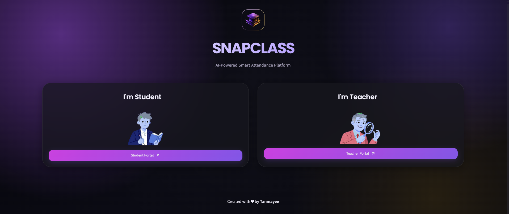
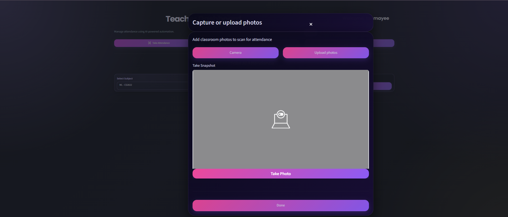

<div align="center">


# 🎓 SnapClass

### AI-Powered Smart Attendance Management System

Face Recognition • Voice Recognition • Machine Learning • Supabase

<br>


</div>

---

## 📌 Overview

SnapClass is an AI-powered attendance management platform that automates classroom attendance using Face Recognition and Voice Recognition technologies.

The system eliminates manual roll calls, reduces proxy attendance, and provides a modern attendance experience for both teachers and students.

---

## 🚀 Features

### 👨‍🏫 Teacher Module

- Create and manage subjects
- Generate join codes
- Face attendance sessions
- Voice attendance sessions
- Student management
- Attendance tracking
- Auto enrollment

### 👨‍🎓 Student Module

- Subject enrollment
- Face registration
- Voice registration
- Attendance history
- Subject dashboard

### 🤖 AI Features

- Face Detection
- Face Embedding Generation
- Face Classification
- Voice Embedding Generation
- Speaker Verification
- Automatic Attendance Logging

---

## 🛠 Tech Stack

| Category | Technologies |
|-----------|-------------|
| Frontend | Streamlit |
| Backend | Python |
| Database | Supabase |
| Machine Learning | Scikit-Learn (SVM) |
| Face Recognition | face_recognition, dlib |
| Voice Recognition | Resemblyzer, Librosa |
| Data Processing | NumPy, Pandas |
| Security | Bcrypt |
| QR Generation | Segno |

---

## 🏗 System Architecture

```text
Teacher/Student
      │
      ▼

 Streamlit UI
      │
      ▼

Business Logic
      │

 ┌────┴─────┐
 ▼          ▼

Face      Voice
Pipeline  Pipeline

 ▼          ▼

Embeddings & Models

      ▼

  Supabase

      ▼

Attendance Logs
```

## 📂 Project Structure

```bash
SnapClass
│
├── app.py
│
├── assets/
│
├── src/
│   ├── components/
│   ├── database/
│   ├── pipelines/
│   ├── screens/
│   └── ui/
│
├── requirements.txt
│
└── README.md
```

---

## ⚙️ Installation

### Clone Repository

```bash
git clone https://github.com/yourusername/SnapClass.git

cd SnapClass
```

### Create Virtual Environment

```bash
python -m venv venv
```

### Activate Environment

Windows

```bash
venv\Scripts\activate
```

Linux / Mac

```bash
source venv/bin/activate
```

### Install Dependencies

```bash
pip install -r requirements.txt
```

---

## 🔑 Environment Variables

Create a `.env` file

```env
SUPABASE_URL=YOUR_SUPABASE_URL

SUPABASE_KEY=YOUR_SUPABASE_KEY
```

---

## ▶️ Run Application

```bash
streamlit run app.py
```

Application starts at:

```text
http://localhost:8501
```

---

## 📸 Screenshots

### Home Screen



### Teacher Dashboard


### Student Dashboard


### Face Attendance



### Voice Attendance


---

## 🔄 Face Attendance Workflow

1. Teacher starts attendance session
2. Students submit face images
3. Face embeddings are generated
4. SVM classifier identifies students
5. Attendance is automatically recorded

---

## 🎙 Voice Attendance Workflow

1. Student records voice sample
2. Voice embeddings are generated
3. Speaker verification is performed
4. Attendance is marked automatically

---

## 📊 Database Tables

- teachers
- students
- subjects
- subject_students
- attendance_logs

---

## 🎯 Resume Highlights

- Built an AI-powered attendance management system using Face Recognition and Voice Recognition.
- Developed face and voice embedding pipelines.
- Integrated Machine Learning models for attendance automation.
- Designed a complete teacher-student attendance workflow.
- Implemented cloud database integration using Supabase.
- Built a production-ready Streamlit application.

---

## 🧠 Key Concepts Used

### Machine Learning

- Support Vector Machine (SVM)
- Classification
- Embedding Generation

### Computer Vision

- Face Detection
- Face Recognition
- Face Embeddings

### Speech Processing

- Voice Embeddings
- Speaker Verification

### Software Engineering

- Modular Architecture
- Database Design
- Authentication
- State Management

---

## 🚀 Future Enhancements

- Real-Time Webcam Attendance
- Mobile Application
- Attendance Analytics Dashboard
- QR Attendance Support
- Cloud Deployment
- AI Insights
- Multi-Classroom Management

---

## 👩‍💻 Author

### Tanmayee Satpathy

B.Tech(CSE)

Kalinga Institute of Industrial Technology (KIIT)

---
